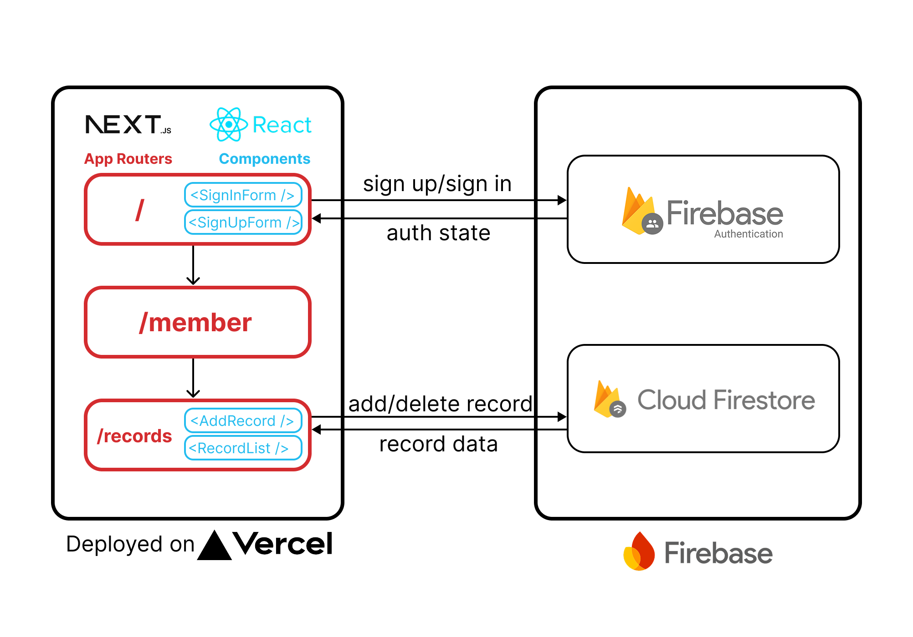

# [Accounting](https://react-nextjs-practice-tau.vercel.app/)

簡單的線上記帳小工具。以 React 及 Next.js 作為前端框架，並使用 Google Firebase 服務進行會員帳號驗證以及資料存取。

# 測試帳號

|     | 帳號           | 密碼   |
| --- | -------------- | ------ |
| 1   | test1@mail.com | 123456 |
| 2   | test2@mail.com | 123456 |

# 目錄

- [主要功能](#主要功能)
- [技術堆疊](#技術堆疊)
- [功能細節](#功能細節)
- [聯絡我](#聯絡我)

# 主要功能

1. 登入或註冊會員

  

2. 進行記帳

  

# 技術堆疊

前端

- 框架：[React](https://react.dev/), [Next.js](https://nextjs.org/)
- 語言：[TypeScript](https://www.typescriptlang.org/)
- 第三方套件: [clsx](https://github.com/lukeed/clsx), [react-toastify](https://github.com/fkhadra/react-toastify)

後端及資料庫

- 帳號驗證：Firebase Authentication
- 資料存取：Cloud Firestore Database

部屬

- [Vercel](https://vercel.com/)

# 聯絡我

email: [tanni6808450@gmail.com](mailto:tanni6808450@gmail.com)
